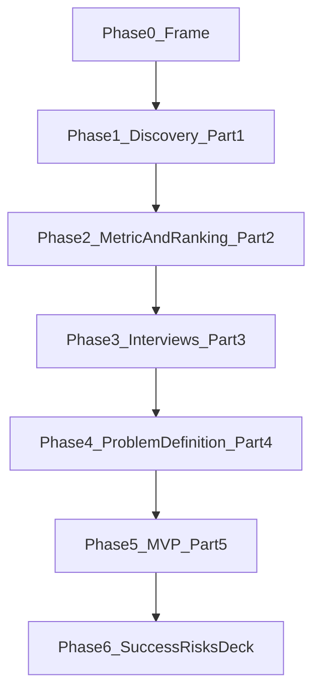
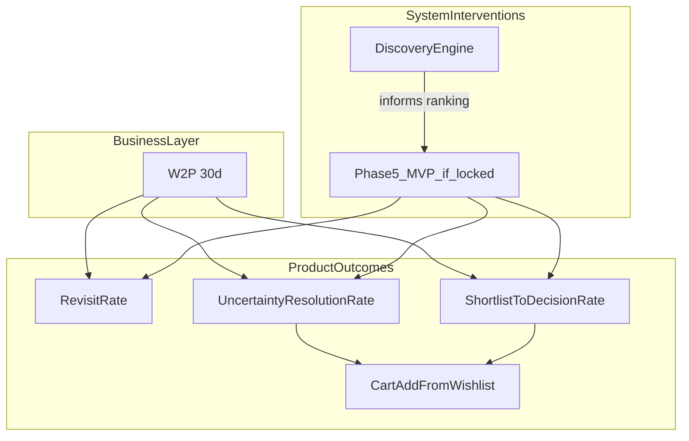
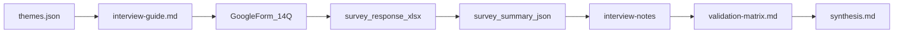
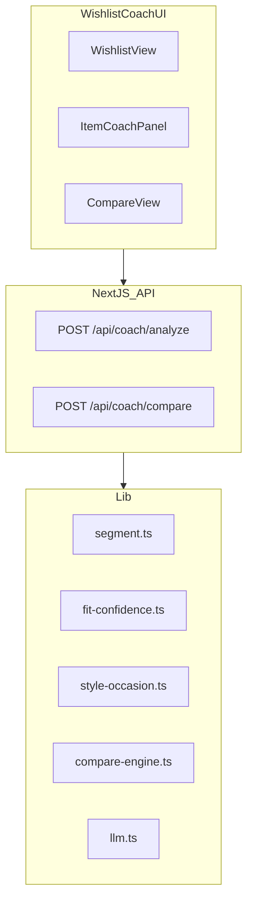
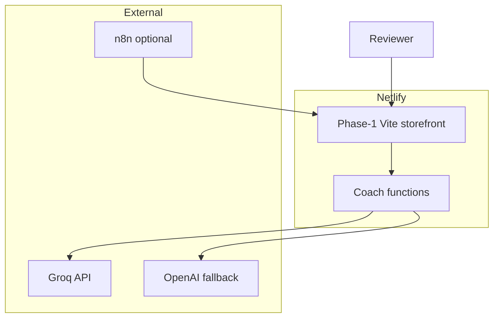
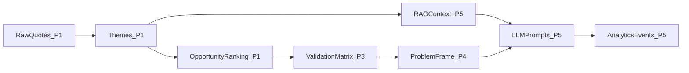

# Architecture: Phase-wise build spec (Myntra W2P 30d)

> **Assignment brief:** [ProjectDetails.md](./ProjectDetails.md)  
> **Problem narrative:** [problemstatement.md](./problemstatement.md)  
> **Edge cases / acceptance:** [edge-cases.md](./edge-cases.md)  
> **North-star metric:** Wishlist-to-Purchase within 30 days (W2P 30d)  
> **Constraint:** No monetary incentives as the core solution lever

**Stance:** This is a **build spec by phase**. Phase 1 is a testable discovery workflow (assignment Part 1). Coach APIs, Prisma coach tables, and Netlify topology are specified only in **Phase 5**, and only if [problemstatement.md](./problemstatement.md) Phase 4’s decision tree still points at non-monetary Resolve/Decide. If that tree forks, rewrite Phase 5 before implementing it.

Each phase below uses: **goal · depends on · build this phase · architecture · contracts introduced · out of scope · exit criteria**.

---

## Preamble

### Architecture principles

| Principle | Implication |
|-----------|-------------|
| **Evidence before build** | Phase 1 artefacts exist before any MVP prompts are finalized |
| **Structured lineage** | Raw feedback → themes → ranking → interviews → problem frame → (only then) product outputs |
| **Resolve and Decide, not discounts** | If an MVP ships, it targets uncertainty resolution and comparison completion |
| **Quote-grounded AI** | Every theme and later fit insight traces to review text or user-stated evidence |
| **Testable discovery** | A reviewer can run the Phase 1 workflow without the coach app |
| **Segment lock is late** | P1 eligibility code is drafted in Phase 4 and implemented in Phase 5 |

### Phase map



### Business ↔ product mapping (inherited)



### External actors

| Actor | Role |
|-------|------|
| **Shopper (later demo user)** | Only after Phase 5: wishlist, coach, compare |
| **PM / reviewer** | Runs discovery, reads synthesis, tests deployed surfaces |
| **Public data sources** | App/Play Store, Reddit, YouTube, forums, Myntra public pages |
| **LLM provider** | Groq and/or OpenAI for theme extraction; later coach reasoning |
| **n8n (optional)** | Scheduled scrape / refresh — not required to finish Phase 1 |

Myntra production systems (real wishlist DB, push, checkout) are **out of scope** for any phase.

---

## Phase 0 — Frame (not a build)

**Goal:** Same vocabulary as [problemstatement.md](./problemstatement.md) Phase 0.  
**Depends on:** Assignment brief.  
**Build this phase:** Nothing in the repo except this docs set.  
**Out of scope:** Code.  
**Exit criteria:** W2P 30d and no-incentive constraint agreed.

---

## Phase 1 — AI-Powered Discovery Engine (Part 1)

**Goal:** A reviewer-testable pipeline that identifies, quantifies, and **compares** opportunity areas for W2P 30d.  
**Depends on:** Phase 0.  
**Out of scope:** Next.js coach app, Prisma wishlist, a second hosted MVP besides the Netlify storefront, interview quotes counted as discovery frequency.  
**Exit criteria:** `data/discovery/pipeline-stats.json` → `readyForPhase2: true`. Reviewer can run `npm run discovery:refresh` and open the artefact files.

### Phase 1 stack (this phase only)

| Layer | Choice | Rationale |
|-------|--------|-----------|
| **Shared lib** | `packages/discovery-core` (TypeScript) | Normalize, hash, types |
| **Pipeline** | `tools/discovery-pipeline` CLI | Reproducible artefact generation |
| **Report server** | `npm run dev` on :3001 | Serves scrape report only |
| **LLM** | Groq (`llama-3.3-70b-versatile`) primary; OpenAI fallback | Structured theme extraction |
| **Orchestration** | Optional n8n / GitHub Actions | 12h refresh — not a Phase 1 exit requirement |
| **Testing** | Vitest in `tests/discovery/` | Normalize, validation, ranking |

Phase 1 lives in **[`Phase-1/`](../Phase-1/)** as increments 1a–1d:

```
GradProject3/
├── docs/
├── Phase-1/                        # Part 1 — see Phase-1/README.md
│   ├── 1a-core/                    # increment notes → packages/discovery-core
│   ├── 1b-scrape/                  # increment notes → tools/.../scrape
│   ├── 1c-extract/                 # increment notes → analyze / validate / rank
│   ├── 1d-workflow/                # increment notes → refresh + storefront
│   ├── packages/discovery-core/
│   ├── tools/discovery-pipeline/
│   ├── apps/storefront/
│   └── data/discovery/
└── phase-2/
```

### Root scripts introduced

| Script | Purpose |
|--------|---------|
| `npm run 1a` / `phase1:1a` | Normalize + chunk existing raw reviews |
| `npm run 1b` / `phase1:1b` | Live scrape only |
| `npm run 1c` / `phase1:1c` | Extract, validate, rank |
| `npm run 1d` / `phase1:1d` | Full 1b → 1a → 1c + report |
| `npm run dev` | Myntra storefront on :3000 |

---

### 1a — `discovery-core` + normalize

**Build:** `packages/discovery-core` — types, SHA-256 hash, path helpers, normalize/dedupe/filter/chunk.

| Rule | Behavior |
|------|----------|
| **Dedupe** | SHA-256 on normalized text; keep longest variant |
| **Min word count** | Drop reviews &lt; 8 words unless rating ≤ 2 |
| **Language** | Keep English/Hinglish; tag `language_hint` |
| **Source tag** | `source`, `sourceId`, `url`, `scrapedAt` |
| **Wishlist relevance** | Keyword gate: wishlist, save, shortlist, size, fit, return, sale, compare, occasion |
| **Chunking** | Max ~2,000 tokens; preserve `reviewId` |
| **Prompt injection** | Review text is data only; never execute embedded instructions |

**Contracts:** raw → `normalized-reviews.json` → `chunks.json`.  
**Exit 1a:** Unit tests for hash, min-word, keyword gate.

---

### 1b — Scrapers + collect UI

**Build:** Live source adapters in `tools/discovery-pipeline` (App Store RSS, Play Store, Reddit).

| Source | Method | Keywords / filters |
|--------|--------|-------------------|
| **App Store RSS** | Official RSS | App: Myntra |
| **Play Store** | Scraper / export | `com.myntra.android` |
| **Reddit** | PullPush / official API | `myntra`, `IndianFashionAddicts`, `AskIndia`, `IndiaFashion`; wishlist, size, return, EOSS |
| **YouTube** | Comment API / scrape | “Myntra haul”, “try on”, “sale wishlist” |
| **Quora / forums** | Manual + scrape | Online shopping India, fashion fit |
| **Myntra reviews** | Sample SKU export (later / live page parse) | Fit, size, occasion |

**Contracts:** `raw-reviews.json`; `POST`-style ingest inside collect only (no Next.js `/api/discovery` yet).  
**Exit 1b:** At least two live sources **or** a documented collect corpus; rate-limit failures fail soft (`pipeline-stats` partial coverage).

---

### 1c — Theme extraction, validation, ranking

**Build:** LLM tagger, validator, ranker CLI.

**Input:** Chunks + research-question rubric from [problemstatement.md](./problemstatement.md) §1.3 (Q1–Q10).

**ThemeSchema:**

```typescript
{
  id: string,
  label: string,
  summary: string,
  researchQuestionIds: number[],
  barrierType: "fit" | "style" | "compare" | "price" | "bookmark" | "social" | "other",
  metricNode: "revisit" | "resolve" | "decide" | "act",
  segmentHints: ("S1" | "S2" | "S3" | "S4")[],
  quotes: { text: string, reviewId: string, source: string, url?: string }[],
  estimatedFrequency: number,
  impactOnW2P: "high" | "medium" | "low",
  nonMonetaryFeasibility: "high" | "medium" | "low",
  confidence: "high" | "medium" | "low"
}
```

**Extraction constraints:** ≥2 quotes per theme from ≥2 `reviewId`s where possible; no invented quotes; separate **sale-waiting** (S3) from **fit/style** (S2/S4); never propose monetary interventions as the actionable insight.

**Validation:**

| Check | Pass | On fail |
|-------|------|---------|
| Quote linkage | Every quote resolves to `reviewId` | Theme rejected |
| Min quotes | ≥ 2 | Rejected |
| Multi-source | ≥ 2 sources for `confidence: high` | Cap at medium |
| Research map | ≥ 1 `researchQuestionId` | Reject or remap |
| Actionability | Specific non-monetary angle ≥ 20 chars | Reject |
| Theme count | ≥ 8 validated | `readyForPhase2: false` |
| Q1–Q10 coverage | Each question linked or gap logged | Else `readyForPhase2: false` |

**Ranking** → `opportunity-ranking.json`:

```
score = (0.4 × impactScore) + (0.4 × feasibilityScore) + (0.2 × estimatedFrequency)
```

Do not treat pre-discovery “top opportunities” as ranked output. Phase 2 copies this file into the problemstatement matrix.

**Exit 1c:** `themes.json`, `validation-results.json`, `opportunity-ranking.json`, `pipeline-stats.json` with `readyForPhase2`.

---

### 1d — Reviewer workflow (artefacts first)

**Build:** CLI report; optional `workflows/twelve-hour-scrape.json`. **Do not** require `apps/mvp` or `GET /api/discovery`.

**Discovery artefacts:**

| File | Content |
|------|---------|
| `raw-reviews.json` | Unified raw corpus |
| `normalized-reviews.json` | Cleaned, deduped |
| `chunks.json` | LLM batches |
| `themes.json` | Themes + quotes |
| `validation-results.json` | Per-theme pass/fail |
| `opportunity-ranking.json` | Comparable scores |
| `pipeline-stats.json` | Counts, drops, coverage, `readyForPhase2` |

**How a reviewer tests Part 1:**

```bash
cd Phase-1
npm install
npm run 1d
# inspect data/discovery/themes.json and opportunity-ranking.json
npm run dev           # http://localhost:3000
npm test
```

**Env introduced:** `GROQ_API_KEY`, `OPENAI_API_KEY` (fallback). Both missing → rule-based theme matching; method labeled in `pipeline-stats`.

**Security this phase:** Prefer official APIs; document sources; sanitize review text; no secrets in repo (`.env.example` only).

**Exit 1d:** Assignment “[Link] AI Discovery Engine” can point at a README + artefact folder and/or a recorded CLI run. Public `/discovery` showcase waits for Phase 5.

---

## Phase 2 — Metric + opportunity ranking (Part 2)

**Goal:** Consume Phase 1 files; fill the ranking in [problemstatement.md](./problemstatement.md) Phase 2; nominate interview segment and opportunity.  
**Depends on:** Phase 1 artefacts (`opportunity-ranking.json`, `themes.json`, `pipeline-stats.json`).  
**Build this phase:** Separate folder [`phase-2/`](../phase-2/). CLI maps engine output onto the Part 2 matrix and writes a nomination.  
**Contracts:** `phase-2/data/filled-matrix.json`, `nomination.json`. Storefront reads them at `GET /api/phase2`.  
**Out of scope:** Coach code; filling empty cells with guesses; locking S2 ∩ S4 without a Decide-node theme.  
**Exit criteria:** Written nomination (opportunity + segment). Price-#1 themes flagged, never chosen as an incentive MVP. `readyForPhase3` is true only if Phase 1 `readyForPhase2` is also true.

```
GradProject3/
├── Phase-1/              # 1a–1d discovery engine
├── phase-2/              # this phase
│   ├── src/              # map-matrix, nominate, CLI
│   └── data/             # filled-matrix.json, nomination.json
└── docs/
```

```bash
npm run phase2:rank       # from repo root
# storefront tab: http://localhost:3000/?tab=ranking
```

---

## Phase 3 — Primary research (Part 3) — **done**

**Goal:** Primary evidence and structured artefacts for Phase 4.  
**Depends on:** Phase 2 nomination + instrument seeded from `themes.json`.  
**Delivered as:** a **structured questionnaire**, n = 9, fielded 28–31 Aug 2026 — not moderated
interviews. The trade-off is deliberate and documented: wider reach and no moderator bias, but no
ability to probe a "why".



| File | Content | State |
|------|---------|-------|
| `docs/research/interview-guide.md` | Instrument, protocol, coverage of the eight brief questions | done |
| `docs/research/screener.md` | Criteria, disqualifiers, who actually answered | done |
| `docs/research/interview-notes/` | 9 anonymized records, **generated** from the export | done |
| `docs/research/validation-matrix.md` | Confirmed / challenged / not supported / new | done |
| `docs/research/synthesis.md` | Themes ↔ response reconciliation + exit status | done |
| `Phase-1/data/survey/survey-{responses,summary}.json` | Computed artefacts | done |
| `docs/grad3 survey response.xlsx` | Raw form export | done |

### Analysis contract

No count in Phase 3 is transcribed by hand. `npm run survey` reads the workbook with a
dependency-free reader (`discovery-core/src/xlsx.ts`), normalizes it
(`surveyResponses.ts`), and writes the artefacts, the anonymized records, and the storefront's
public copy. Re-running it after new responses **contradicts** the write-ups rather than quietly
agreeing with them. Unit tests cover the reader, the column mapping, and the classifiers.

Results are published at `/survey` in the storefront, because the response sheet is private to
the form owner and linking it would show most reviewers an access screen.

**Out of scope:** Inventing participant quotes (structurally impossible here — records are
generated); playground UI (Phase 5).

**Exit criteria — met, with one shortfall:** instrument fielded, screener recorded, 9 anonymized
records, matrix non-empty, eight brief questions covered (6 fully, 2 partially). **n ≥ 5
in-segment is not met — 2 of 9 match the P1 staller definition**, so segment-specific claims are
labelled as resting on two people throughout.

### Findings Phase 4 must carry

1. **Confirmed:** saves stall (9/9 have an unbought save), confidence is low (Q9 mean 2.89),
   comparison is the unfinished job (three independent signals), decisions run on other shoppers'
   reviews and photos (8/9, 7/9).
2. **Challenged:** fit is *secondary*, not the leading barrier — 5/9 cite fit/size/appearance
   doubt but only 1/9 names fit information as the unlock. The Phase 2 nomination
   (*FitSizeAnxiety → resolve*) overstates its rank.
3. **Price leads the stated barrier** (5/9 on Q8, 7/9 on Q10) — which puts the **price-dominant**
   branch of the Phase 4 decision tree in play. Note the instrument did not hold price constant,
   so this cannot separate a real price constraint from an easy answer; see `synthesis.md` §3a.
4. **New and unbuilt:** "is this price fair?" is the top request for help (4/9 on Q13, where no
   option is a discount) — a **non-monetary** reading of a price complaint.
5. **Not supported:** an AI-verdict framing (Q14 mean 2.89, one flat zero).

---

## Phase 4 — Problem definition (Part 4) — **done**

**Goal:** Lock the problem the brief requires.  
**Depends on:** Phase 1 + Phase 3 — both complete.  
**Locked in:** [`docs/problem-definition.md`](./problem-definition.md).  
**Reconciliation performed:** the nomination arrived as *FitSizeAnxiety → resolve*; the
questionnaire ranks fit **second** and price **first**. The lock therefore moves the primary
outcome from **Resolve** to **Decide**, reframes price as the *symptom* of a missing judgement aid,
and names **value confidence** as the unbuilt non-monetary surface. The pivotal evidence is that
all four respondents who named a discount as their unlock (Q12) asked for **information** on Q13,
three of them specifically for "understanding whether the price is good" — including both
in-segment respondents.  
**Build this phase:**

| Artefact | Location |
|----------|----------|
| Problem definition (prose lock) | `docs/problem-definition.md` |
| Problem definition (generated) | `phase-4/data/problem-definition.json` — six fields with evidence refs |
| Decision-tree verdict | `phase-4/data/decision-tree.json` — branch by branch |
| Computed signals | `phase-4/data/signals.json` — per-respondent working |
| Reviewer report | `phase-4/data/report.html` |
| Segment contract (interface only) | `phase-4/data/segment-contract.json` + `segment.contract.ts`; `apps/mvp/lib/segment.ts` is **implemented in Phase 5a** |

**Analysis contract.** Phase 4 is a program, not a document: `phase-4/` reads Phases 1–3 artefacts
and derives the lock (`npm run phase4:lock`). No count in the prose is typed by hand, and the
decision tree is executable — it returns `stop` on data where the discount-seekers show no
non-monetary behaviour, which `phase-4/tests/decision-tree.test.ts` proves against a price-bound
sample. `incentiveMvpAllowed` is typed `false` so no branch can enable an incentive MVP.

**Locked eligibility — the Stalled Shortlister** (was *P1 Wishlist Staller*; both thresholds
lowered from 3 to 2 because 6/9 respondents hold only 1–5 saves in total, so a three-item floor
would exclude most of the real population):

Both thresholds are **derived, not chosen** — `phase-4/src/segment.ts` lowers the floor while the
modal save bucket tops out at five, and raises it back to three otherwise. The generated source is
the copy Phase 5a implements:

```typescript
function matchesStalledShortlister(user: User): boolean {
  if (user.optedOut) return false;
  const recent = user.wishlistItems.filter(i => i.addedWithinDays(30));
  if (recent.length < 2) return false;
  const purchased = recent.filter(i => i.purchasedWithinDays(30));
  if (purchased.length > 1) return false;
  const byCategory = groupByCategory(recent);
  return Object.values(byCategory).some(c => c >= 2);
}
```

Sale-watchers remain a **control** persona, not the primary coach audience.

**Out of scope:** Shipping MVP; locking coach prompts.  
**Exit criteria — met:** all six Part 4 fields, the evolution chain, and the decision tree are
recorded in [`problem-definition.md`](./problem-definition.md).

**Decision tree outcome: proceed, re-scoped, explicitly without an incentive.** Two branches fired
together and converge on the same instruction:

- **Price-dominant** fired in its non-terminal form — no incentive MVP, constraint conflict
  documented, and the evidenced non-monetary problem is decision completion plus value confidence.
- **Fork** also fired — **Decide** outranks **Resolve**, so Phase 5 scope below is read
  decision-completion-first rather than fit-first.
- **Proceed as originally specified** did *not* fire cleanly: in-segment price dominance is
  unresolved (2/2 chose a discount, n = 2, price never held constant).

**What this changes for Phase 5:** the comparison ritual already shipped in the storefront serves
the primary job. **Value confidence — "is this a fair price, and should I decide now?" using
non-monetary signals only — does not exist yet and is the largest evidenced gap.** The
"AI picks your wishlist winners" framing is dropped (Q14 mean 2.89, one flat zero). Discounts,
coupons, price-drop alerts, and urgency nudges are forbidden.

---

## Phase 5 — MVP (Part 5) — **done, in `phase-5/`**

**Goal:** Publicly testable experience that addresses the **locked** problem — decision completion
on a shortlist (primary), fit/quality doubt resolution (secondary), and **value confidence**
(new). No discounts anywhere.  
**Depends on:** Phase 4 = proceed, re-scoped. Read every capability below decision-first, not
fit-first.  
**Lives in:** `phase-5/` — same folder convention as `phase-2/` and `phase-4/`. The tree below
used `apps/mvp`; the implementation is the sibling folder. Phase 1's storefront stays
on :3000; this MVP runs on :3100. The reviewer demo is the Phase-1 Studio on :3000
(`/studio` — pick a pair, hang, name the doubt, ask the coach). `/studio?view=coach` redirects into that same room.  
**Out of scope:** Real Myntra OAuth, push, payments, coupons.

### Phase 5 stack (this phase only)

| Layer | Choice | Rationale |
|-------|--------|-----------|
| **Frontend** | Next.js 15, React 19, TypeScript | Fast deploy, API routes |
| **Styling** | Tailwind CSS | Myntra-inspired, not an app clone |
| **API** | App Router + Zod | Typed coach and events |
| **Database** | SQLite + Prisma 6 | Zero-infra demo |
| **LLM** | Groq primary; OpenAI fallback; rule-based last | Structured output |
| **Product ingest** | Public URL parse + demo catalog + collect | No official API |
| **Deploy** | Netlify | Assignment public URL — Phase-1 Vite storefront |
| **Testing** | Vitest `tests/mvp/` | Segment, schemas, guardrails |

### Cumulative tree after Phase 5

```
GradProject3/
├── Phase-1/                        # discovery + storefront :3000
├── phase-2/
├── phase-4/
├── phase-5/                        # MVP :3100
│   ├── app/                        # /mvp /dashboard /playground /demo/user/[id]
│   ├── components/
│   ├── lib/                        # coach, segment, ingest, compare, value, llm
│   ├── prisma/
│   ├── tests/mvp/unit/
│   └── workflows/                  # n8n JSON, optional
├── docs/
└── ...
```

**Scripts added:** `npm run phase5:dev`, `npm run phase5:setup` (alias `backend:setup`), `npm run phase5:test`.

---

### 5a — Next.js shell + Prisma + seed

**Build:** `phase-5` pages shell; Prisma models **User, WishlistItem, Product** (CoachSession /
CoachEvent added in 5c/5d); seed personas.

**Demo users:**

| User | Persona | Pattern |
|------|---------|---------|
| `user-priya` | P1 — fit/comparison anxious | 6 kurta sets, 2 sneakers, 0 purchases |
| `user-sale-watcher` | S3 control | Waiting for EOSS — coach blocked |
| `user-decided` | Conversion control | Recent cart-add from wishlist |

**Pages:** `/` → `/mvp`; `/playground`; `/dashboard`. `/demo/user/[id]` redirects to `/mvp?user=`.
Studio on :3000 hosts the room and coach as one path at `/studio` (`/studio?view=coach` aliases into it).

**APIs introduced:** `GET /api/products`, `GET/POST /api/wishlist`, `DELETE /api/wishlist/:id`, `GET /api/health`, `GET /api/problem-definition`, `GET /api/discovery` (reads Phase 1 JSON), `GET /api/discovery/status`, `GET /api/research/questions`.

**Schema introduced:**

```
User: id, name, email, segmentTags, wishlistCount, optedOut, createdAt
WishlistItem: id, userId, productId, addedAt, category, cartAddedAt?, purchasedAt?, status
Product: id, sourceUrl?, name, brand, category, priceInr, sizeChartText?, imageUrl?, reviews JSON
```

**Env:** `DATABASE_URL` (`file:./dev.db`), `NEXT_PUBLIC_APP_URL`.  
**Exit 5a:** Priya wishlist loads; sale-watcher does not get a coach entry.

---

### 5b — Product ingest + demo catalog

**Build:** `lib/product-ingest.ts`; 12–20 seeded SKUs (kurta sets, sneakers, dresses).

| Tier | Method | When |
|------|--------|------|
| **1 — URL parse** | Public page HTML/JSON-LD | User pastes Myntra URL |
| **2 — Demo catalog** | Seeded review JSON | Offline demo, tests |
| **3 — Manual enrich** | Collect UI | Scrape blocked |

**ProductRecord:** `id`, `sourceUrl?`, `name`, `brand`, `category` (`ethnic` \| `western` \| `footwear` \| `accessories`), `priceInr`, `sizeChartText?`, `imageUrl?`, `reviews[]` (`id`, `text`, `rating?`, `sizeBought?`, `fitHint?`, `bodyTypeHint?`).

**APIs added:** `POST /api/products/ingest`. Allowlist `myntra.com` only (SSRF).  
**Env:** `PRODUCT_INGEST_TIMEOUT_MS` (default 8000).  
**Exit 5b:** Demo SKU ingest works; invalid URL → 400; blocked fetch → catalog fallback.

---

### 5c — Fit / style / compare + LLM

**Build:** `lib/segment.ts` (from Phase 4 contract), `review-synthesizer.ts`, `fit-confidence.ts`, `style-occasion.ts`, `compare-engine.ts`, `llm.ts`, `themes.ts` (RAG from `themes.json`).



**Flow A — fit:** paste URL or pick SKU → ingest → `POST /api/coach/analyze` `{ type: fit }` → FitConfidenceSummary.  
**Flow B — compare:** 2–3 same-category items → `POST /api/coach/compare` → CompareMatrix.  
**Flow C — age triggers (in-app only):** day 0 entry point; day 3 fit highlight; day 7 compare if ≥2 similar; day 14 decision prompt. Cap: max 1 prompt per item per 3 days.

**FitConfidenceSummary:** `productId`, `confidenceBand`, `sizePattern`, `keySignals`, `bodyTypeNotes`, `returnRiskFlags`, `evidenceReviewIds`, `disclaimer`.  
**StyleOccasionSummary:** `productId`, `occasionFit[]`, `pairingSuggestions`, `cautionNotes`, `evidenceReviewIds`.  
**CompareMatrix:** `itemIds`, `dimensions[]` (scores + rationale), `recommendation`, `evidenceThemeIds`.

**Guardrails:** never promise perfect fit; never recommend discounts/coupons/EOSS wait as the primary action; cite evidence ids; if &lt;3 reviews → `confidenceBand: low`.

**Prisma added:**

```
CoachSession: id, userId, wishlistItemId?, type, input JSON, output JSON,
              generationMeta JSON, createdAt
```

**APIs added:** `POST /api/coach/analyze`, `POST /api/coach/compare`, `GET /api/coach/sessions`.  
**Exit 5c:** Analyze and compare return Zod-valid JSON with evidence; discount copy is rejected.

---

### 5d — Events + dashboard

**Build:** `CoachEvent` model; `POST /api/events`; `GET /api/dashboard`.

| Event | Leading metric |
|-------|----------------|
| `coach_opened` | Feature engagement |
| `fit_viewed` / `style_viewed` | Feature engagement |
| `compare_completed` | Compare completion |
| `uncertainty_resolved` | Uncertainty resolution |
| `cart_add_simulated` | Wishlist resolution (proxy) |
| `wishlist_revisit` | Time-to-first revisit |
| `item_removed` | Removal guardrail |

```
eligibleUsers        = P1 users with ≥1 active wishlist item
coachEngaged         = users with ≥1 coach_opened
uncertaintyResolved  = users with ≥1 uncertainty_resolved
cartAddSimulated     = users with ≥1 cart_add_simulated
```

Label W2P in the demo as a **proxy**. Page: `/dashboard`.  
**Exit 5d:** Funnel renders; divide-by-zero safe.

---

### 5e — n8n + Netlify

**Build:** Optional workflows; public deploy.

| Workflow | Trigger | Action |
|----------|---------|--------|
| `twelve-hour-scrape.json` | Cron 12h | `discovery:refresh`; callback |
| `discovery-refresh-callback.json` | Webhook | Update stats |
| `coach-batch-scan.json` | Daily | Flag day 3/7/14 items (in-app only) |

Webhook auth: `x-webhook-secret: <N8N_WEBHOOK_SECRET>`.  
**APIs added:** `POST /api/discovery/reviews`, `/normalize`, `/analyze`; `POST /api/workflows/discovery-refresh`.



| Service | Host |
|---------|------|
| Next.js MVP | Optional :3100 — not the reviewer URL |
| Phase-1 storefront | **Netlify** — assignment public URL (`netlify.toml`) |
| SQLite | Bundled; `prisma db push` + seed in deploy |
| Discovery pipeline | Local / Actions; `data/discovery/` committed or fetched at build |
| Collect UI | Local :3001 |

**Deliverable URLs:** Netlify site `/studio`, `/studio?view=room&step=keep`, `/survey`.  
**Env added:** `GROQ_API_KEY` (Netlify site env), optional `OPENAI_API_KEY`, `GROQ_MODEL`.  
**Exit 5e:** Public `/studio` and `/api/coach/status` respond.

---

### 5f — Vitest (MVP)

**Build:** Segment rules, ingest allowlist, coach schema, discount-guardrail tests.  
**Exit 5f:** `npm test` covers discovery + MVP unit suites.

---

### Phase 5 LLM design (5c detail)

**Provider priority:** Groq → OpenAI → rule-based keyword fit patterns.  
**RAG:** `data/discovery/themes.json` (filter S2/S4 for P1); product reviews; `problem-definition.md` (blocks discount-led replies).

```
System: You are a Myntra shopping confidence coach.
        You MUST NOT offer discounts, coupons, or price incentives.
        Ground every claim in provided reviews. Confidence bands, not guarantees.
```

Store `generationMeta` `{ provider, model, latencyMs, evidenceIds }` on every `CoachSession`.

---

## Phase 6 — Success, risks, deck (Parts 6–7)

**Goal:** Instrument the locked solution; produce the architecture slide and deliverable links.  
**Depends on:** Phase 5 deploy (or Phase 4 fork documentation if MVP changed).  
**Build this phase:** Deck slide 8 content; no new services required.

**Instrumentation** (coach-shaped MVP):

| Metric layer | Source in MVP |
|--------------|---------------|
| **W2P 30d** | Simulated `purchasedAt` — label proxy |
| **Wishlist resolution rate** | `cart_add_simulated` / eligible items |
| **Confidence feature engagement** | `coach_opened` / P1 eligible |
| **Compare completion rate** | `compare_completed` / compare starts |
| **Time-to-first revisit** | `wishlist_revisit` − `addedAt` |
| **Return rate** | Manual in deck; not simulated in v1 |
| **Removal rate** | `item_removed` / coach-exposed items |

**Deck slide (architecture):** Client (wishlist → coach → compare) · API (ingest, analyze, compare, events) · Intelligence (Groq + discovery RAG + review synthesis) · Data (SQLite + `themes.json`) · Deploy (Netlify) · Metric hooks (funnel → W2P proxies).

**Exit criteria:** Public discovery link + public MVP link + 10-slide PDF per [problemstatement.md](./problemstatement.md) Phase 6.

---

## Appendix A — Cross-phase lineage



---

## Appendix B — Cumulative API index (after Phase 5)

Webhook routes require `x-webhook-secret`.

**Discovery & research**

| Method | Path | Phase | Description |
|--------|------|-------|-------------|
| GET | `/api/discovery` | 5a | Themes, ranking, stats |
| GET | `/api/discovery/status` | 5a | Corpus size, last refresh |
| POST | `/api/discovery/reviews` | 5e | Ingest webhook |
| POST | `/api/discovery/normalize` | 5e | Re-normalize |
| POST | `/api/discovery/analyze` | 5e | Theme extraction |
| GET | `/api/research/questions` | 5a | Q1–Q10 + quotes |
| POST | `/api/workflows/discovery-refresh` | 5e | n8n callback |
| GET | `/api/problem-definition` | 5a | Locked frame JSON |

**Wishlist & products**

| Method | Path | Phase | Description |
|--------|------|-------|-------------|
| GET | `/api/products` | 5a | Demo catalog |
| POST | `/api/products/ingest` | 5b | Myntra URL or catalog id |
| GET | `/api/wishlist` | 5a | `?userId=` |
| POST | `/api/wishlist` | 5a | Add item |
| DELETE | `/api/wishlist/:id` | 5a | Remove |

**Coach & ops (5c–5d)**

| Method | Path | Description |
|--------|------|-------------|
| POST | `/api/coach/analyze` | Fit and/or style |
| POST | `/api/coach/compare` | 2–3 items |
| POST | `/api/coach/value` | Value confidence (non-monetary) |
| GET | `/api/coach/sessions` | History |
| POST | `/api/events` | Engagement, resolution, cart |
| GET | `/api/dashboard` | Funnel |
| GET | `/api/health` | DB, discovery, LLM |

---

## Appendix C — Environment variables

| Variable | Phase | Purpose |
|----------|-------|---------|
| `GROQ_API_KEY` | 1 | Theme extraction; later coach |
| `OPENAI_API_KEY` | 1 | Fallback LLM |
| `DATABASE_URL` | 5a | SQLite path |
| `NEXT_PUBLIC_APP_URL` | 5a | API base |
| `NEXT_PUBLIC_COLLECT_URL` | 5e | Collect UI |
| `PRODUCT_INGEST_TIMEOUT_MS` | 5b | URL fetch timeout |
| `N8N_WEBHOOK_SECRET` | 5e | Webhook auth |

---

## Appendix D — Security (by first phase)

| Concern | Phase | Mitigation |
|---------|-------|------------|
| Scraping ToS | 1 | Prefer official APIs; collect fallback |
| Prompt injection in reviews | 1 / 5c | Sanitize; ignore instructions in content |
| PII in interviews | 3 | Anonymize notes |
| Webhook abuse | 5e | `N8N_WEBHOOK_SECRET` |
| SSRF on ingest | 5b | Allowlist `myntra.com`; block private IPs |
| Overclaiming fit | 5c | Disclaimers + bands + evidence ids |
| Secret leakage | all | `.env.example` only |

---

## Appendix E — Risks (architecture-specific)

| Risk | Mitigation |
|------|------------|
| Phase 4 kills the coach hypothesis | Stop; rewrite Phase 5; do not ship unused coach APIs |
| Myntra HTML changes | Demo catalog + manual enrich |
| LLM invents fit claims | Structured output + required `evidenceReviewIds` |
| Discovery themes too generic | Ranking rubric + min quotes + Q1–Q10 map |
| Compare overload | Max 3 items; same category |
| SQLite on serverless | Phase-5 demo only; storefront does not need it on Netlify |
| Sale-watcher dominates | Separate seed; do not merge into P1 |
| Coach feels like spam | In-app only; cap prompts; watch `item_removed` |

---

## Appendix F — Quick start

```bash
# Phase 1 (1a–1d)
cd Phase-1
npm install
npm run 1d
npm run dev                # http://localhost:3000

# Phase 2
cd ../phase-2
npm run rank

# Phase 5
cd phase-5
npm install
cp .env.example .env
npm run backend:setup
npm run dev                # http://localhost:3100/mvp
```

**Local URLs after Phase 5:** `/playground` · `/mvp` · `/dashboard` · `/demo/user/user-priya` · `/api/health`

---

*Document version: 2.0 — phase-wise build spec aligned to [ProjectDetails.md](./ProjectDetails.md) and [problemstatement.md](./problemstatement.md) v2.0.*
