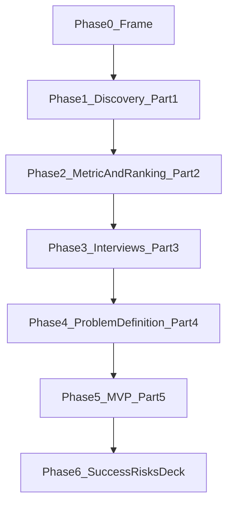
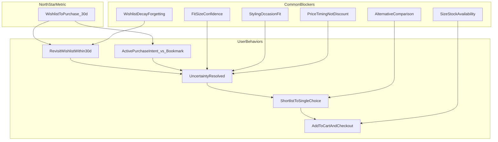

# Problem Statement: Myntra Wishlist-to-Purchase (W2P 30d)

> **Assignment brief:** [ProjectDetails.md](./ProjectDetails.md)  
> **Architecture (phase-wise build):** [architecture.md](./architecture.md)  
> **Edge cases / acceptance:** [edge-cases.md](./edge-cases.md)  
> **Product:** Myntra — Growth Team, PM  
> **North-star metric:** Increase % of users who purchase at least one wishlisted item within **30 days** of adding it  
> **Solution constraint:** No monetary incentives (no extra coupons, cashback, or price-drop discounts as the core solution)

**Stance:** The brief does not give the user problem. This document frames how we **discover** it. Hypotheses are tools to quantify or kill — they are not decisions. Wishlist Confidence Coach is a **working hypothesis for Phase 5 only**, and only if Phase 4’s decision tree still points at non-monetary Resolve/Decide for the chosen segment.

---

## How to read this document

| Phase | Assignment part | This phase produces | Exit gate |
|-------|-----------------|---------------------|-----------|
| **0 — Frame** | Context | Product, metric definition, constraint | Frame locked |
| **1 — Discovery** | Part 1 | Testable engine + Q1–Q10 evidence + comparable opportunities | `readyForPhase2: true` |
| **2 — Metric + ranking** | Part 2 | W2P decomposition + ranking **filled from Phase 1 output** | Highest-potential area chosen |
| **3 — Interviews** | Part 3 | 5–6 interviews in the Phase 2 segment; all eight brief questions | Validation matrix complete |
| **4 — Problem definition** | Part 4 | Segment, outcome, root cause, workarounds, value, evolution chain | Decision tree → keep or kill Phase 5 hypothesis |
| **5 — MVP** | Part 5 | Deployed, testable experience for the **locked** problem | Public URL |
| **6 — Success, risks, deck** | Parts 6–7 + deliverables | Metric hierarchy with rationale; risks; 10-slide deck | Submission-ready |



**Provisional ≠ decided.** Every table marked provisional must be replaced or struck after the phase that owns the evidence.

---

## Executive summary

Millions of Myntra users browse fashion products, save items they like, and add products to their wishlists. A wishlist is an explicit interest signal: the user has identified something they like but has stopped short of purchasing. Over time, wishlists grow while only a small share of those items convert within a meaningful window.

Myntra’s strategic goal is to **increase the percentage of users who purchase at least one wishlisted item within 30 days of adding it** — unlocking purchase frequency, monetization from existing users, and more value from high-intent demand already on the platform.

The underlying user problem is **not given**. It must be discovered through an AI-powered analysis of public voice-of-customer, then validated with 5–6 interviews in a segment chosen from that analysis. Any solution **cannot** rely on monetary incentives.

This document is the product narrative for that path. System design lives in [architecture.md](./architecture.md). Acceptance and failure modes live in [edge-cases.md](./edge-cases.md).

---

## Phase 0 — Frame

**Goal:** Lock product, role, north-star definition, and the hard constraint.  
**Depends on:** [ProjectDetails.md](./ProjectDetails.md).  
**This phase produces:** Shared vocabulary for every later phase.  
**Out of scope:** User problem, segment lock, MVP.  
**Exit criteria:** W2P 30d formula and no-incentive rule are unambiguous.

### 0.1 Role and product

You are a Product Manager on the **Growth Team at Myntra**. Myntra is India’s leading fashion e-commerce platform (ethnic wear, western casual and formal, footwear, accessories, beauty-adjacent). Users engage through seasonal events (End of Season Sale, Big Fashion Festival), brand drops, influencer-led discovery, and everyday browsing.

### 0.2 Why the wishlist matters

Unlike passive browsing or abandoned carts, a wishlist action is **explicit, persistent, and user-initiated**:

| Signal | Intent strength | Persistence | Growth lever |
|--------|-----------------|-------------|--------------|
| Product view | Low | Session-bound | Awareness |
| Cart add | High | Short-lived | Checkout optimization |
| **Wishlist add** | **High (declared interest)** | **Days to months** | **Intent monetization** |

Users who wishlist have already passed “do I like this?” The open question is **what blocks purchase** — and that blocker may differ by segment. Phase 1 must quantify those blockers; Phase 0 does not pick one.

### 0.3 North-star metric

**Wishlist-to-Purchase within 30 days (W2P 30d)**

```
W2P 30d = (Users who purchased ≥1 wishlisted item within 30 days of adding it)
          ÷ (Users who added ≥1 item to wishlist in the measurement period)
```

**Cohort logic:** Each wishlist add starts a 30-day window. Default per the brief: a conversion counts if the user purchases **any** wishlisted item within 30 days of an add in the cohort. Day-31 purchases do not count.

Improving this metric could increase **purchase frequency** without new acquisition cost, improve **monetization per MAU**, reduce **wishlist bloat** that degrades notification relevance, and complement existing sale/loyalty levers with **non-discount** conversion paths that protect margin.

### 0.4 Hard constraint

The solution **cannot offer monetary incentives**. This excludes:

- Extra coupons or cashback for wishlist items
- Price-drop alerts framed as “buy now because it’s cheaper”
- Loyalty-points bonuses tied to wishlist conversion

Non-monetary levers remain in scope **after** discovery: information synthesis, confidence, comparison support, styling/occasion context, social validation, occasion planning — only if evidence shows they move W2P 30d.

---

## Phase 1 — AI-Powered Discovery Engine (Part 1)

**Goal:** Analyze public user feedback at scale **before** proposing a solution. Go beyond sentiment summaries: **identify, quantify, and compare** opportunity areas that could influence W2P 30d.  
**Depends on:** Phase 0 metric and constraint (so ranking knows what “impact” means).  
**This phase produces:** A testable workflow, Q1–Q10 evidence, validated themes, comparable opportunity scores.  
**Out of scope:** Interviews, problem lock, MVP, coach APIs.  
**Exit criteria:** `data/discovery/pipeline-stats.json` has `readyForPhase2: true` (≥8 validated themes, quote-linked, S3/price themes separated from fit/style/compare). A reviewer can run the workflow and inspect artefacts.

**Allowed stack:** Claude, GPTs, agents, workflows, n8n, Zapier, Perplexity, or any AI-native stack. Build details: [architecture.md](./architecture.md) Phase 1.

### 1.1 Testable deliverable (assignment: [Link] AI Discovery Engine)

| Surface | What a reviewer does |
|---------|----------------------|
| **Primary (Phase 1)** | Run `npm run discovery:refresh`; open `data/discovery/` (`themes.json`, `opportunity-ranking.json`, `pipeline-stats.json`, `validation-results.json`) |
| **Collect fallback** | `npm run dev:collect` — paste/CSV ingest when scrapers are blocked |
| **Later showcase (Phase 5)** | Public `/discovery` + `GET /api/discovery` if the MVP app exists — **not required to finish Phase 1** |

**Deliverable link (placeholder):** [AI Discovery Engine — test link TBD](#)  
**Deck artefact:** 1-slide workflow (sources → ingest → extract → quantify → rank) inside the final 10-slide deck.

### 1.2 Workflow (must compare, not only summarize)

```
Sources → Ingest / normalize / dedupe → Theme extraction (LLM)
       → Quantification (frequency, segment co-occurrence, intent vs bookmark)
       → Opportunity ranking (impact on W2P 30d × non-monetary feasibility × evidence)
```

Sentiment-only output **fails Part 1** ([edge-cases.md](./edge-cases.md) A-D01).

### 1.3 Research questions → required artefact fields

The engine must help answer every question. Each row must be fillable from `themes.json` after a successful run.

| ID | Question (from brief) | Required fields on matching themes |
|----|----------------------|-------------------------------------|
| Q1 | Why do users add fashion products to their wishlist? | `barrierType` / intent tags; ≥2 quotes |
| Q2 | What prevents wishlisted products from eventually being purchased? | `barrierType`; `impactOnW2P`; quotes |
| Q3 | What uncertainties remain after users have identified a product they like? | Themes tagged to **Resolve** node |
| Q4 | What causes users to postpone a purchase? | Postpone vs abandon distinction; quotes |
| Q5 | How do users compare multiple shortlisted products? | Themes tagged to **Decide** node |
| Q6 | What information do users seek outside Myntra before purchasing? | External-channel tags (YouTube, WhatsApp, store) |
| Q7 | What role do fit, size, styling, price, reviews, occasion, and social validation play? | One theme or sub-tag per factor; frequencies comparable |
| Q8 | When is the wishlist genuine purchase intent vs a bookmark? | `barrierType: bookmark` vs high-intent themes |
| Q9 | How do these behaviors differ across user segments? | `segmentHints` S1–S4 on themes |
| Q10 | What unmet needs emerge consistently across conversations? | Cross-source themes; `confidence` |

If any question has **zero** linked themes after the pipeline, `readyForPhase2` is false unless the gap is explicitly logged in `pipeline-stats.json` for interview probing.

### 1.4 Data sources

| Source | What to mine | Myntra-specific angles |
|--------|--------------|------------------------|
| **App Store / Play Store reviews** | Wishlist, returns, sizing, sale behavior | “Saved for sale,” “size wrong,” “try-and-buy” |
| **Reddit** | r/myntra, r/IndianFashionAddicts, r/AskIndia, r/IndiaFashion | Haul posts, return rants, EOSS threads |
| **YouTube** | Myntra haul, try-on, sale-prep videos | Comments on fit, dupes, styling |
| **Twitter/X, Instagram** | #Myntra, influencer comment sections | Social proof, occasion buys |
| **Quora / forums** | Online shopping India, fashion advice | Cross-platform comparison before purchase |
| **Product reviews / Q&A on Myntra** | Per-SKU review text | Size/fit mentions, return reasons |
| **Collect UI** | Manual paste / CSV | When scrapers fail; interview quotes tagged `primary_research` (excluded from Phase 1 frequency) |

### 1.5 Hypotheses to quantify or kill (not a solution pick)

> Derived from publicly observable fashion e-commerce patterns. Each must be **scored by the engine** and **validated or challenged in interviews** before it can drive Phase 4.

| Theme | Working insight | Evidence target |
|-------|-----------------|-----------------|
| **Fit & size anxiety** | Users wishlist while unsure, then seek try-on/reviews offline | Returns, “runs small/large,” body type |
| **Wishlist as sale-waitlist** | Intent is real but time-shifted past 30 days | “Myntra sale wishlist” frequency |
| **Styling / occasion mismatch** | Like the item; unsure when/how to wear it | Wedding/festival/office comments |
| **Comparison paralysis** | Many similar items saved; no pick | “Which one should I buy” threads |
| **Bookmark vs intent** | Trend saves mixed with high-intent saves | “love this” vs “maybe later” language |
| **Social validation** | Partner/friend approval before occasion wear | Share / ask-a-friend patterns |
| **Review trust gap** | Users leave the app for YouTube/Instagram try-ons | “Checked YouTube before buying” |
| **Price timing** | Users wait for sales — **cannot** be solved with incentives | Quantify; likely exclude from a non-incentive MVP |

### 1.6 Segment hypotheses (for quantification, not lock)

| ID | Segment | Defining behavior | W2P 30d relevance | Non-incentive MVP fit (hypothesis) |
|----|---------|-------------------|-------------------|-------------------------------------|
| **S1** | Occasion planners | Timeline-driven saves (wedding, festival, first day) | High if occasion falls in 30d | Medium |
| **S2** | Fit-anxious experimenters | New brand/category; return-fear; re-reads size chart | High — doubt blocks cart | High *if* discovery confirms |
| **S3** | Sale watchers | Primary blocker is price timing | Low unless sale in window | **Low** — incentive conflict |
| **S4** | Overloaded comparers | Many items in one category; can’t narrow | High — decision fatigue | High *if* discovery confirms |

**Provisional recruit filter (revisable in Phase 2):** S2 ∩ S4 — 3+ wishlisted items in the same category, genuine liking, blocker is not solely price. **Do not lock P1 until Phase 4.**

### 1.7 Required theme output (compare-ready)

Each theme in `themes.json`:

- Theme name and one-line definition
- Estimated frequency (count / relevant corpus)
- Representative quotes (2–3, with `reviewId` + source; no invented quotes)
- Segment tags (S1–S4)
- Impact on W2P 30d: High / Medium / Low
- Non-monetary intervention feasibility: High / Medium / Low
- Metric-node tag: Revisit | Resolve | Decide | Act
- `researchQuestionIds`: at least one of Q1–Q10

Ranking (filled in Phase 2 from this output) uses impact, feasibility, and frequency — see [architecture.md](./architecture.md) Phase 1c.

---

## Phase 2 — Metric decomposition and opportunity ranking (Part 2)

**Goal:** Break **Wishlist → Purchase** into product outcomes and behaviors; use that tree **together with Phase 1 output** to pick the highest-potential non-monetary opportunity.  
**Depends on:** Phase 1 artefacts (`themes.json`, `opportunity-ranking.json`).  
**This phase produces:** Metric tree; **filled** ranking; chosen interview segment and opportunity area.  
**Out of scope:** Interviews, problem lock, MVP.  
**Exit criteria:** Ranking table is filled from files, not from pre-discovery guesses. One opportunity area and one segment are nominated for Phase 3.

### 2.1 What must change for W2P 30d to move

Conversion is not a single step. It is the product of **re-engagement × uncertainty resolution × decision completion**.



Push notifications that only increase revisit **fail the constraint test** if they do not resolve a purchase-blocking uncertainty. Which node is highest-potential is an **output of ranking**, not an input.

### 2.2 Sub-metrics (definitions)

| Sub-metric | Definition | Influences W2P 30d because… | Validate via |
|------------|------------|----------------------------|--------------|
| **Revisit rate (30d)** | % of wishlist adds where the user opens the wishlist within 30 days | No revisit → no conversion path | Analytics; interviews |
| **Active intent rate** | % of items self-reported as “still planning to buy” vs bookmark | Bookmarks dilute conversion | Discovery language; interviews |
| **Uncertainty resolution rate** | % of items where the blocking doubt is resolved | Unresolved doubt → postpone | Interviews; later MVP leading metrics |
| **Shortlist-to-decision rate** | Among users with 2+ similar items, % who narrow to one choice in 30d | Comparison paralysis blocks cart | Discovery; interviews |
| **Cart-add rate (from wishlist)** | % of wishlisted items added to cart within 30d | Precursor to purchase | Analytics |
| **Wishlist purchase rate (item-level)** | % of wishlisted items purchased within 30d | Item-level conversion | Analytics |
| **Time-to-first revisit** | Median days from add to first wishlist open | Late revisit compresses decision time | Analytics |
| **Size/stock availability** | % of items in-stock in the user’s size at revisit | Hard blocker even with high intent | Analytics |

### 2.3 Opportunity ranking (filled from Phase 1)

Do **not** treat empty cells as guesses. Copied from `opportunity-ranking.json` via [`phase-2/`](../phase-2/).

| Opportunity area | Impact on W2P 30d | Feasibility (no incentives) | Evidence strength | Frequency | Maps to node | Rank |
|------------------|-------------------|----------------------------|-------------------|-----------|--------------|------|
| Fit & size confidence synthesis | high | high | medium | 0.379 | resolve | 1 |
| Styling / occasion guidance | high | high | high | 0.136 | resolve | 2 |
| Wishlist compare & prioritization | high | high | medium | 0.136 | decide | 3 |
| In-app social proof (review/try-on synthesis) | high | medium | medium | 0.045 | resolve | 5 |
| Share-for-feedback | medium | medium | high | 0.121 | decide | 7 |
| Wishlist revisit nudges (generic) | medium | medium | medium | 0.061 | revisit | 8 |
| Price-drop / sale alerts | — | **Excluded** (monetary) | — | — | — | Exclude |
| Back-in-stock alerts | unobserved | unobserved | none — not in Phase 1 ranking | — | act | — |
| ReturnFearDelay (additional from engine) | medium | high | medium | 0.455 | resolve | 4 |

Filled by [`phase-2/`](../phase-2/) from `Phase-1/data/discovery/opportunity-ranking.json`. Unobserved cells were **not** guessed.

**Phase 2 decision (from `phase-2/data/nomination.json`):**

- Highest-potential opportunity: **FitSizeAnxiety → resolve**
- Interview segment: **S2 ∩ S4** — ranking includes both Resolve (fit) and Decide (compare). Recruit this intersection; do **not** lock P1 until Phase 4.
- Explicitly not pursuing: Price-drop / sale alerts (monetary)
- `readyForPhase3`: **true** (Phase 1 `readyForPhase2` is also true)
- Act-node (back-in-stock) remains unobserved — do not invent a stock-alert MVP.

---

## Phase 3 — Primary research (Part 3)

**Goal:** Validate or challenge Phase 1–2 with **5–6** interviews in the segment chosen in Phase 2. AI insights are a starting point only.  
**Depends on:** Phase 2 nomination + interview guide derived from `themes.json`.  
**This phase produces:** `docs/research/` notes, validation matrix, synthesis.  
**Out of scope:** Final problem lock (Phase 4), MVP.  
**Exit criteria:** 5–6 completed interviews in-segment; every brief question covered; matrix filled (confirmed / challenged / new); no invented “real” quotes.

### 3.1 Target segment (provisional — replace if Phase 2 ranking differs)

**Working filter (from Phase 2 nomination):** S2 ∩ S4 — multiple items in the same category, genuine purchase interest, stall on fit/style/comparison rather than price alone. P1 eligibility is still **not locked**.

### 3.2 Recruitment

- Active Myntra user (≥1 order in last 6 months)
- Added **≥3 items** to wishlist in last 30 days; purchased **0–1** of them
- Mix of gender and categories: ethnic, western, footwear
- **≥2 participants** with **5+** items in the same category
- Screen out users whose **only** blocker is “waiting for sale” (S3) unless Phase 1 shows they are the majority (then document the constraint conflict)

### 3.3 Protocol (30–40 min) — brief coverage

**Opening:** Walk through the last 3 wishlisted items.

| # | Question area | Brief requirement |
|---|----------------|-------------------|
| 1 | Why did you save each item? | Why they saved |
| 2 | Do you still intend to buy it? What changed? | Whether they still intend to purchase |
| 3 | What is stopping you **this week even if the price stayed the same**? | What is stopping them |
| 4 | What would need to be true to purchase without waiting for a sale? | What would make them purchase |
| 5 | What information are you still missing? | What information they still need |
| 6 | Are you considering alternatives — on Myntra or elsewhere? | Whether they are considering alternatives |
| 7 | What did you do **outside the app** before deciding? | What happens outside the app |
| 8 | How do you compare multiple wishlisted items today? | Comparison behavior |
| 9 | How do you deal with uncertainty about fit, size, or styling? | How they currently overcome uncertainty |

**Closing:** If Myntra could help with one **non-discount** thing on your wishlist, what would it be?

Missing any of the eight brief topics fails Part 3 ([edge-cases.md](./edge-cases.md) A-R03).

### 3.4 Validation matrix (fill after interviews)

| Hypothesis | Confirmed / Challenged / New | Action |
|------------|------------------------------|--------|
| Fit/size is the primary non-price blocker | | |
| Comparison paralysis in 5+ item shortlists | | |
| Users leave Myntra for YouTube/Instagram try-ons | | |
| Sale-waiting is dominant vs minority | | |
| Occasion timing drives postponement | | |
| Final segment and root cause for Phase 4 | | |

**Interview artefact link (placeholder):** [Interview notes / survey URL TBD](#)

---

## Phase 4 — Problem definition (Part 4)

**Goal:** Articulate the problem the brief requires — from evidence, not from the working hypothesis.  
**Depends on:** Phase 1 quantification + Phase 3 matrix.  
**This phase produces:** `docs/problem-definition.md` (lock) and the evolution chain.  
**Out of scope:** Building the MVP. Solution direction is an **input to Phase 5**, not a Phase 4 deliverable.  
**Exit criteria:** All six required fields filled; evolution chain complete; decision tree recorded. If the root cause is monetary, **do not** proceed to an incentive MVP.

### 4.1 Required fields (assignment)

Fill these in `docs/problem-definition.md` after interviews. The blocks below are a **working sketch to falsify**, not the locked problem.

| Field | Working sketch (replace after Phase 3) |
|-------|----------------------------------------|
| **Target user segment** | *Provisional:* P1 Wishlist Staller — fit- and comparison-anxious shopper (S2 ∩ S4). Persona sketch “Priya” is a fixture for later demo seeds, not proof. |
| **Product outcome** | *Provisional:* Wishlist resolution rate (P1 items cart-added within 30d of save). Upstream of W2P 30d. |
| **Root cause** | *Provisional:* Wishlist captures interest but does not help resolve purchase-blocking uncertainty before intent decays. |
| **Existing workarounds** | YouTube/Instagram try-ons; WhatsApp polls; many-tab compare; offline trial; wait for EOSS; “I can always return.” |
| **User value** | Confidence and lower cognitive load — **if** that is the confirmed blocker. |
| **Business value** | Higher W2P 30d, frequency, margin protection — **if** the intervention is non-monetary and on-segment. |

**Representative quote** may appear only from a real interview or a labeled illustrative quote. Do not present illustrative copy as research.

### 4.2 Thinking evolution chain (living)

Required by the brief. Update the TBD lines after each phase; do not skip steps.

```
Business Metric: W2P 30d
    ↓ decompose (Phase 2)
Product Outcomes: Revisit × Uncertainty Resolution × Decision Completion
    ↓ AI discovery (Phase 1 — fill from themes.json)
Themes / ranked opportunities: TBD
    ↓ primary research (Phase 3 — fill from synthesis)
Validation: TBD
    ↓ problem definition (Phase 4)
Problem: TBD
    ↓ solution direction (input to Phase 5 — not a Phase 4 output)
MVP direction: TBD (see decision tree)
```

The brief’s example: research might show fit confidence for one segment and price uncertainty for another. **Which problem we pursue is a Phase 4 output.**

### 4.3 Decision tree (gates Phase 5)

```
IF Phase 3 confirms a non-monetary Resolve and/or Decide blocker
   AND S3/price is not the dominant in-segment cause
THEN proceed to Phase 5 with a confidence / decision-support MVP
     (working name: Wishlist Confidence Coach)

ELSE IF price is dominant even at current price
THEN do not build an incentive MVP; document constraint conflict;
     pick another evidenced non-monetary problem or stop

ELSE IF occasion, social, or another node ranks higher
THEN rewrite Phase 5 scope to that problem before any coach contracts
```

Architecture and edge cases **do not** lock coach APIs, Prisma coach tables, or Vercel topology until this tree says proceed.

---

## Phase 5 — MVP (Part 5) — conditional

**Goal:** Design and **deploy** a functional MVP for the problem locked in Phase 4, so a reviewer can interact with it.  
**Depends on:** Phase 4 decision tree = proceed.  
**This phase produces:** Public URL.  
**Out of scope until lock:** Coach schemas, compare engine, ingest — see [architecture.md](./architecture.md) Phase 5.  
**Exit criteria:** Publicly testable prototype, workflow, or agent. Figma-only does not meet the brief.

### 5.1 Working hypothesis (only if Phase 4 confirms Resolve/Decide)

**Wishlist Confidence Coach** — an AI-powered experience on wishlisted items that helps users resolve fit, styling, and comparison uncertainty **without** monetary incentives.

| Capability | Blocker | Status |
|------------|---------|--------|
| Fit confidence summary from reviews | Fit / size | Hypothesis |
| Styling & occasion context | Styling / occasion | Hypothesis |
| Compare 2–3 same-category items | Comparison | Hypothesis |
| Decision prompt | Decide node | Hypothesis |

Triggers (if built): wishlist open; item age 3 / 7 / 14 days without cart add (capped); “Help me decide.”

### 5.2 Form factor

| Option | Pros | Cons |
|--------|------|------|
| **Standalone Next.js demo** | Fast deploy; testable | Not inside Myntra |
| AI agent + tools | Conversational | Needs product data |
| n8n + simple UI | Matches brief stack examples | Weaker UX |
| Figma-only | Realistic frames | **Fails “deployed and testable”** |

**Recommendation if Phase 4 confirms:** standalone Next.js on Vercel; paste Myntra URL or use a mock catalog. Details in [architecture.md](./architecture.md) Phase 5a–5f.

### 5.3 Explicitly out of scope (all Phase 5 variants)

- Coupons, cashback, or “special price for wishlist items”
- Price-drop alerts as the primary value
- Full Myntra app rebuild
- Push at scale (in-app simulation only)

**Deployed MVP link (placeholder):** [Production MVP URL TBD](#)

---

## Phase 6 — Success, risks, and deliverables (Parts 6–7)

**Goal:** Start from the business metric; define what the **locked** solution would move; name why it might fail.  
**Depends on:** Phase 4 problem; Phase 5 shape (hypothesis metrics below assume the coach — revise if the tree forks).  
**This phase produces:** Metric hierarchy with **definition and rationale**; risk register; 10-slide deck.  
**Exit criteria:** Every metric has both definition and rationale. Risks are specific to this solution. Deck meets brief guidelines.

### 6.1 Metric hierarchy

| Layer | Metric | Definition | Rationale |
|-------|--------|------------|-----------|
| **North star** | **W2P 30d** | % users with ≥1 wishlist purchase within 30d of add | Assignment business metric |
| **Primary** | **Wishlist resolution rate (chosen segment)** | % segment wishlisted items cart-added within 30d | Direct product outcome the MVP can influence |
| **Primary** | **Wishlist purchase rate (item-level, segment)** | % segment wishlisted items purchased within 30d | Downstream of resolution |
| **Leading** | **Confidence feature engagement** | % eligible users who complete fit summary or compare | Early signal in a demo; predicts resolution *if* coach ships |
| **Leading** | **Time-to-first revisit** | Median days from add to first return | Re-engagement driver |
| **Leading** | **Compare completion rate** | % who start compare and view ≥2 summaries | Decide-node intervention |
| **Guardrail** | **Return rate (wishlist cohort)** | Returns ÷ orders from wishlist-influenced purchases | Fit advice must not increase returns |
| **Guardrail** | **Wishlist removal rate post-feature** | Removals after coach vs control | Annoyance / irrelevance |
| **Guardrail** | **Session abandonment** | Engage coach, drop before cart | Flow friction |
| **Guardrail** | **Nudge fatigue** | “Were these reminders helpful?” | Avoid spammy re-engagement |

Demo instrumentation uses simulated cart/purchase flags and must be labeled as **proxies** on the dashboard and deck.

### 6.2 Experiment sketch (after lock)

- **Control:** Standard wishlist (or no coach)
- **Treatment:** Locked intervention on eligible segment items
- **MDE:** Set after a baseline proxy exists — do not invent +X pp
- **Duration:** 30-day window + 1 week buffer

### 6.3 Risks and mitigations (solution-specific)

| Risk | Why it might happen | Mitigation |
|------|---------------------|------------|
| **Hypothesis wrong; price is the dominant blocker** | EOSS culture; sale-conditioned shoppers | Segment S3 in discovery; interview “would you buy today at current price?”; Phase 4 tree may kill the coach |
| **AI fit advice increases returns** | Overconfident size guidance | Ground in reviews; confidence bands; return guardrail |
| **Users ignore nudges** | Fatigue; 40+ item lists | Cap frequency; measure engagement |
| **Discovery is generic sentiment** | Shallow prompts | Require quotes, quantification, comparison; fail `readyForPhase2` otherwise |
| **30-day window vs sale cycles** | Users wait 45+ days for BFF | Exclude sale-only wishlisters from primary segment |
| **MVP scope creep** | Fit + style + compare + social in v1 | After lock: one category + compare max 3 |
| **Standalone demo ≠ Myntra data** | No official API | URL ingest + public reviews + interview validation |
| **Share-for-feedback privacy** | Users won’t share lists | Optional; not Phase 5 unless Phase 4 demands it |

### 6.4 Deliverables checklist

| Deliverable | Status | Link |
|-------------|--------|------|
| **[Link] AI Discovery Engine** | Pending | [Test workflow URL TBD](#) |
| **1-slider in deck** (how the engine works) | Pending | Inside PDF |
| **[PDF] 10-slide deck** | Pending | TBD |
| **[Link] Deployed MVP** | Pending | [Production URL TBD](#) |
| **Interview notes / survey** | Pending | [URL TBD](#) |

### 6.5 Deck content map (10 slides max)

Slide titles state the **key message**, not a generic label. Slides 4–7 stay tentative until Phases 1–4 complete.

| Slide | Title (message) | Content |
|-------|-----------------|---------|
| 1 | **Wishlist intent is high but 30-day conversion stays low** | Context, W2P 30d, constraint |
| 2 | **30-day W2P decomposes into revisit, resolve, and decide** | Metric tree |
| 3 | **AI discovery turns public voice-of-customer into ranked opportunities** | 1-slider workflow |
| 4 | **_Fill from Phase 1 ranking_** | Findings, quotes, frequencies |
| 5 | **_Fill from Phase 3 synthesis_** | 5–6 interviews; confirmed vs challenged |
| 6 | **_Fill from Phase 4 problem statement_** | Segment, root cause, workarounds, evolution chain |
| 7 | **_Fill from Phase 4→5 decision_** | Solution rationale; why non-monetary |
| 8 | **MVP is deployed and testable** | Architecture, live link, screenshots |
| 9 | **Success metrics and guardrails protect margin and returns** | North star → primary → leading → guardrails |
| 10 | **Key risks and what we would do next** | Top risks, mitigations |

### 6.6 Deck guidelines (from the brief)

- Fellow name **not** present anywhere
- **10 slides max**
- **Font size ≥ 14** (strict)
- Titles state the key message
- Readable on color; color-blind-safe
- Hyperlink artefacts; public access
- File size &lt; 40 MB if the portal requires it

---

## Phase-exit checklist

| # | Action | Gate |
|---|--------|------|
| 1 | Run discovery engine on listed sources | Phase 1 |
| 2 | Fill ranking from artefacts; nominate segment | Phase 2 |
| 3 | Conduct 5–6 interviews; fill matrix | Phase 3 |
| 4 | Lock `problem-definition.md`; run decision tree | Phase 4 |
| 5 | Build and deploy MVP **only if** tree says proceed | Phase 5 |
| 6 | Instrument leading metrics; write risks | Phase 6 |
| 7 | 10-slide PDF with public artefact links | Phase 6 |

---

## Appendix A — Assignment cross-reference

| Assignment part | Phase | Section |
|-----------------|-------|---------|
| Part 1: AI Discovery Engine | 1 | Phase 1 |
| Part 2: Metric decomposition + opportunities | 2 | Phase 2 |
| Part 3: User research | 3 | Phase 3 |
| Part 4: Define the problem | 4 | Phase 4 |
| Part 5: Build MVP | 5 | Phase 5 |
| Part 6: Define success | 6 | §6.1 |
| Part 7: Risks & mitigation | 6 | §6.3 |
| Deliverables + deck | 6 | §6.4–6.6 |

---

## Appendix B — Myntra context (for discovery and interviews)

- **Try & Buy / easy returns:** May **delay** decision (“I can always return”) — probe in interviews
- **EOSS / Big Fashion Festival:** Wishlist-as-sale-list is common — segment carefully
- **Myntra Insider:** Users may already have discount access — reinforces the non-incentive constraint
- **Category nuances:** Ethnic (occasion + fit), sneakers (brand size inconsistency), western formal (tailoring / return risk)
- **Competitive set:** AJIO, Nykaa Fashion, Amazon Fashion, offline trial — ask about external research

---

*Document version: 2.0 — evidence-gated to [ProjectDetails.md](./ProjectDetails.md). Hypotheses pending discovery and primary research.*
